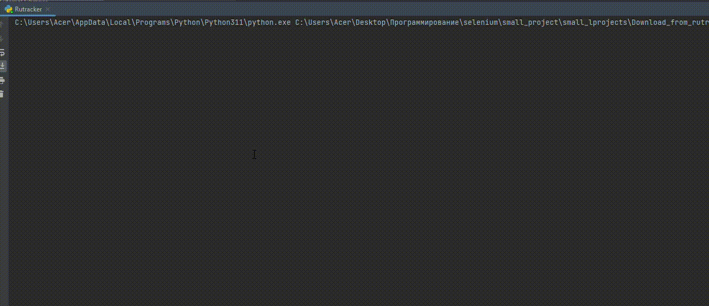
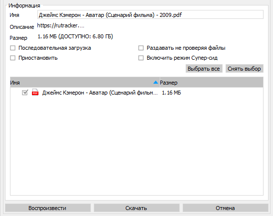

# Проект Download_from_Rutracker

## Оглавление  
[1. Описание проекта](README.md#Описание-проекта)  
[2. Какой кейс решаем?](README.md#Какой-кейс-решаем)  
[3. Библиотеки](README.md#Библиотеки)  
[4. Обход блокировки](README.md#Обход-блокировки)  
[5. Этапы работы программы](README.md#Этапы-работы-программы)    
[6. Результаты](README.md#Результатыы)  
[7. Выводы](README.md#Выводы) 

### Описание проекта    
Скрипт для скачивания торрент файлов с  заблокированного сайта "Rutracker"

### Какой кейс решаем?
В связи блокироки сайта на территории РФ, требуется реализовать обход блокироки и скачать торрент файл по введенным данным

### Библиотеки
В данном проекте использовались библиотеки:

- Requests
- Bs4

### Обход блокировки
Для обхода блокировки использовались открытые и бесплатные прокси-сервера

### Этапы работы программы
<ol>
    <li>Настройка сессии Requests с подключением ip-прокси</li>
    <li>Авторизация на сайте Rutracker</li>
    <li>Ввод данных пользователем</li>
    <li>Отправка запроса с данными</li>
    <li>Вывод результатов поиска</li>
    <li>Пользователь выбирает какй именно файл ему нужно скачать</li>
    <li>Скачивание файла</li>
</ol>

### Результаты:
Получен torrent файл в папке дирректории

